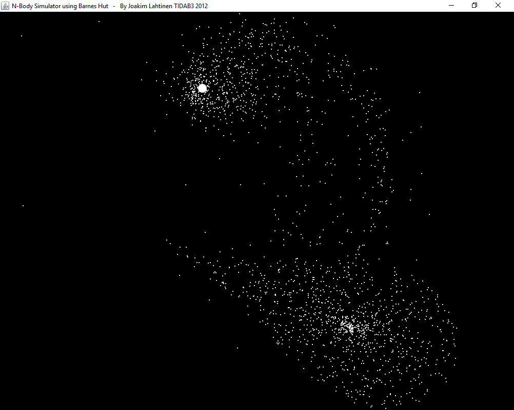

# galaxy-simulation

Four different implementations gravitational n-body simulation. In order of worst to best performance:
- Sequential (brute-force)
- Parallelized (brute-force)
- Sequential Barnes-Hut (approximation)
- Parallelized Barnes-Hut (approximation)

More galaxy datasets can be found in the original location:
ftp://ftp.cs.princeton.edu/pub/cs126/barnes-hut

References:
https://en.wikipedia.org/wiki/Barnes%E2%80%93Hut_simulation
